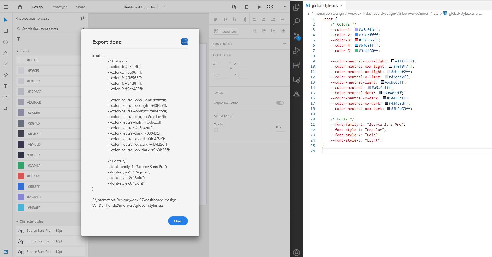

# adobe-xd-to-css-variables
This Adobe XD Plugin will automate the process of migrating global styles to CSS variables. The plugin will look at the colors, font families and font styles that are saved in the asset pannel. These are grouped, ordered and written to disk. The output will look something like this:

``` CSS
:root {
	/* Colors */
	--color-1: #a3a0fbff;
	--color-2: #3b86ffff;
	--color-3: #ff6565ff;
	--color-4: #54d8ffff;
	--color-5: #3cc480ff;

	--color-neutral-xxxx-light: #ffffffff;
	--color-neutral-xxx-light: #f0f0f7ff;
	--color-neutral-xx-light: #ebebf2ff;
	--color-neutral-x-light: #d7dae2ff;
	--color-neutral-light: #bcbccbff;
	--color-neutral: #a5a4bfff;
	--color-neutral-dark: #808495ff;
	--color-neutral-x-dark: #4d4f5cff;
	--color-neutral-xx-dark: #43425dff;
	--color-neutral-xxx-dark: #3b3b53ff;

	/* Fonts */
	--fonts-1: "Source Sans Pro";
	--font-styles-1: "Regular";
	--font-styles-2: "Bold";
}
```

Note that the neutral colors are sorted and that the names actually make sense.

  
You can watch a short [demo](https://www.youtube.com/watch?v=-Xrg196qaxw "Demo video") as well.
